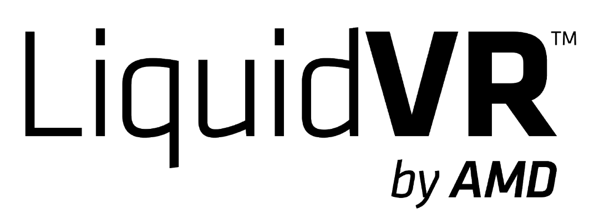

# LiquidVR&trade; SDK

LiquidVR&trade; provides a Direct3D 11 based interface for applications to access the following GPU features: Async Compute, Multi-GPU Affinity, Late-Latch, and GPU-to-GPU Resource Copies[1](#liquidvr-footnote1),[2](#liquidvr-footnote2). 

* **Async Compute** : Provides in Direct3D 11 a subset of functionality similar to async-compute functionality in Direct3D 12.
* **Multi-GPU Affinity** : Provides explicit multi-GPU control via ability to send Direct3D 11 API calls to one or more GPUs via an affinity mask.
* **Late-Latch** : Provides ability to reduce input or tracking latency by reading constant data updated by the CPU after the original Direct3D 11 calls.
* **GPU-to-GPU Resource Copies** : Provides ability to copy resources between GPUs with explicit control over synchronization.

In Version 1.1 (driver 17.4.1 / 17.10.1061), we added support for:
* Motion Estimation: Calculates the motion estimation generated from two surface frames.  Motion estimation works on specific GPUs and can be used for ASW.
* Vulkan Interoperability:  Provides conversion for buffers, surfaces and semaphores.

### Installation
The LiquidVR run-time is automatically installed by the current AMD drivers. All that is needed for usage in an application is the `LiquidVR.h` header file in the `inc` folder.

### Prerequisites
* AMD Radeon&trade; GCN-based GPU (recommend R9 290 series or higher for VR)[3](#liquidvr-footnote3)
* Windows&reg; 7, Windows&reg; 8.1, or Windows&reg; 10
* Radeon Software Crimson Edition drivers or later
* Building the SDK samples requires Visual Studio&reg; 2013

### Getting Started
* A Visual Studio solution for the samples can be found in the `samples` directory.
* Additional documentation can be found in the `doc` directory.

### Attribution
* AMD, the AMD Arrow logo, Radeon, LiquidVR, and combinations thereof are either registered trademarks or trademarks of Advanced Micro Devices, Inc. in the United States and/or other countries.
* Microsoft, Direct3D, DirectX, Visual Studio, and Windows are either registered trademarks or trademarks of Microsoft Corporation in the United States and/or other countries.

### Notes
<a name="liquidvr-footnote1">1</a>: The LiquidVR features are available even if a VR device is not installed on a system.

<a name="liquidvr-footnote2">2</a>: LiquidVR also contains a Direct-to-Display (D2D) interface, but it is not application accessible because it is instead directly used by the head-mounted display (HMD) vendors.

<a name="liquidvr-footnote3">3</a>: All Radeon GPUs based on the Graphics Core Next (GCN) architecture support the current LiquidVR feature set. However, the recommended performance requirements for the best VR experience will vary between different HMD/content platforms. For details on recommended hardware for a particular HMD vendor, see the FAQ here: http://www.amd.com/liquidvr
